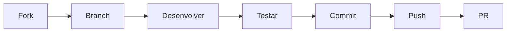

# 🤝 Guia de Contribuição

Obrigado por considerar contribuir com o **Arandu**! Este guia vai te ajudar a entender como participar do projeto de forma eficiente.

---

## 📋 Pré-requisitos

- **Node.js** `>= 20` (recomendado: versão LTS mais recente; Dockerfile usa Node 22)
- **Yarn v1** (Classic)
- **Git**
- Conhecimento básico de **TypeScript**, **React** e **NestJS**

---

## 🚀 Setup do Ambiente

```bash
# Clone o repositório
git clone https://github.com/seu-usuario/arandu-monorepo.git
cd arandu-monorepo

# Instale as dependências
yarn install

# Configure o banco de dados
yarn workspace api prisma generate
yarn workspace api prisma db push

# Inicie o desenvolvimento
yarn dev
```

> ⚠️ Configure as variáveis de ambiente conforme o [README.md](./README.md) antes de iniciar.

---

## 🧱 Estrutura do Projeto

O projeto é um monorepo com **Turborepo** e **Yarn Workspaces**:

```
apps/
├── api/          # API NestJS
└── frontend/     # SPA React + Vite
```

### Convenções

| Aspecto | Padrão |
|---------|--------|
| **Linguagem** | TypeScript estrito (~5.9.3 unificado no monorepo) **(Novo)** |
| **Estilo** | TailwindCSS v4 (`@import "tailwindcss"`) |
| **Estado global** | Zustand v5 |
| **Server state** | TanStack Query v5 |
| **Formatação** | Prettier (config na raiz) |
| **Commits** | Conventional Commits (abaixo) |

---

## 📝 Padrão de Commits

Usamos **Conventional Commits** para manter o histórico organizado e gerar o changelog automaticamente:

```
<type>(<scope>): <descrição>

[opcional: corpo]
[opcional: footer]
```

### Tipos

| Tipo | Quando usar | Exemplo |
|------|-------------|---------|
| `feat` | Nova funcionalidade | `feat(clipboard): add search filter to history` |
| `fix` | Correção de bug | `fix(toolbar): fix overflow measurement on resize` |
| `refactor` | Mudança sem alterar comportamento | `refactor(editor): extract toolbar button component` |
| `style` | Mudança de estilo/CSS | `style(dashboard): adjust notebook grid spacing` |
| `chore` | Tarefas de manutenção | `chore(deps): update tiptap packages` |
| `docs` | Documentação | `docs: add contributing guide` |
| `test` | Testes | `test(flashcard): add unit tests for SM-2 algorithm` |

### Escopos comuns

| Escopo | Área |
|--------|------|
| `editor` | Editor de texto, toolbar, bubble menu |
| `clipboard` | Gestor de histórico de cópia/cola |
| `flashcard` | Flashcards e algoritmo SM-2 |
| `notebook` | Cadernos e dashboard |
| `auth` | Autenticação e registro |
| `planning` | Planejamento, pomodoro, metas |
| `api` | Endpoints e serviços da API |
| `profile` | Perfil, avatar, configurações |
| `deps` | Dependências e pacotes |

---

## 🧪 Testes

### API (NestJS)

```bash
# Testes unitários
yarn workspace api test

# Testes e2e
yarn workspace api test:e2e
```

### Frontend (Vitest)

```bash
# Testes unitários
yarn workspace frontend test

# Com cobertura
yarn workspace frontend test --coverage
```

### Diretrizes

- Escreva testes para **novas funcionalidades**
- Atualize testes existentes ao **modificar comportamento**
- Prefira testar **comportamento** em vez de implementação
- Use mocks apenas para **fronteiras do sistema** (API, localStorage, etc.)
- Frontend: Vitest com jsdom + Testing Library
- API: Jest com ts-jest
- Acesse `getByRole`, `getByText`, etc. em vez de seletores CSS

---

## 🎨 Guia de Estilo (Frontend)

### Componentes

- Use **componentes funcionais** com TypeScript
- Extraia componentes para `components/ui/` quando reutilizáveis
- Prefira composição sobre herança
- Nomeie arquivos com **PascalCase**: `MeuComponente.tsx`

```tsx
// ✅ Correto
interface MeuComponenteProps {
  title: string;
  onAction: () => void;
}

export const MeuComponente: React.FC<MeuComponenteProps> = ({
  title,
  onAction,
}) => (
  <button onClick={onAction} className="...">
    {title}
  </button>
);
```

### Estilos (TailwindCSS v4)

- Use **classes utilitárias** do Tailwind — evite CSS customizado
- Use **variáveis CSS** do tema escuro: `dark:bg-dark-800`
- Prefira `gap-*`, `flex`, `grid` para layout
- Evite `!important` — use especificidade adequada

### Estado

- **Zustand** para estado global (tema, autenticação, status do editor)
- **TanStack Query** para dados do servidor (cache, fetching, mutations)
- **Estado local** com `useState` / `useReducer` para UI transient

---

## 🔀 Fluxo de Contribuição



### Passo a passo

1. **Crie um fork** do repositório
2. **Crie uma branch** a partir de `main`:
   ```bash
   git checkout -b feat/minha-feature
   ```
3. **Desenvolva** a funcionalidade ou correção
4. **Teste** suas mudanças:
```bash
# Verifique se o build não quebra (da raiz do monorepo)
yarn build

# Verifique o typecheck
cd apps/frontend && npx tsc --noEmit --skipLibCheck

# Execute os testes
yarn test

# Execute o lint (obrigatório — falha com qualquer warning)
yarn lint
```
5. **Faça commits** seguindo o padrão
6. **Envie** sua branch e abra um Pull Request

### Checklist do PR

- [ ] O build passa (`yarn build`)
- [ ] Typecheck limpo (`cd apps/frontend && npx tsc --noEmit --skipLibCheck`)
- [ ] Testes passam (`yarn test`)
- [ ] ESLint limpo (`yarn lint`)
- [ ] Código segue as convenções do projeto
- [ ] Commits estão no padrão Conventional Commits
- [ ] Documentação atualizada (se aplicável)

---

## 🐛 Reportando Bugs

Ao reportar um bug, inclua:

1. **Descrição clara** do problema
2. **Passos para reproduzir**
3. **Comportamento esperado** vs **observado**
4. **Ambiente** (navegador, SO, versão do Node)
5. **Logs ou screenshots** (se aplicável)

---

## 💡 Sugerindo Melhorias

Antes de implementar uma melhoria significativa:

1. **Abra uma issue** descrevendo a proposta
2. **Discuta** o design e a abordagem com a equipe
3. **Implemente** após alinhamento

Isso evita retrabalho e garante que sua contribuição seja aceita mais rapidamente.

---

## 📄 Licença

Ao contribuir, você concorda que suas contribuições serão licenciadas sob a mesma licença **MIT** do projeto.

---

<div align="center">
  <p>Feito com ☕ e 📚 — Toda contribuição é bem-vinda!</p>
</div>
